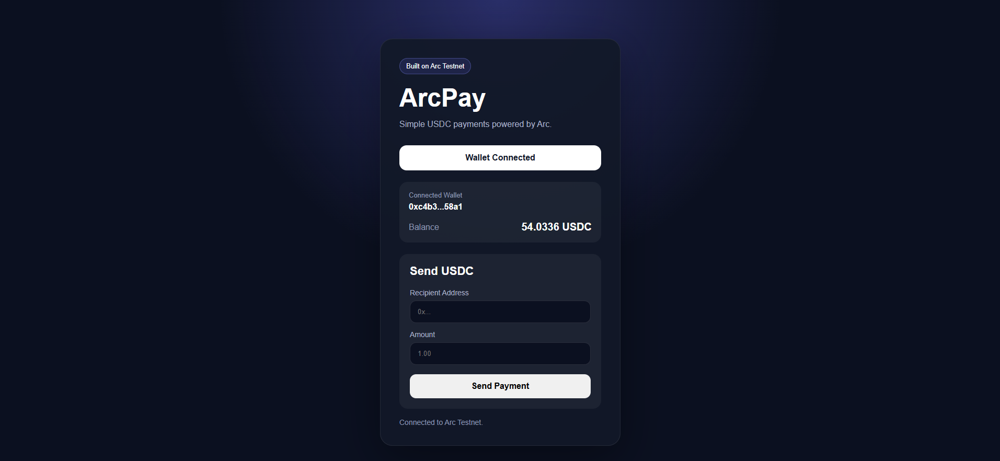
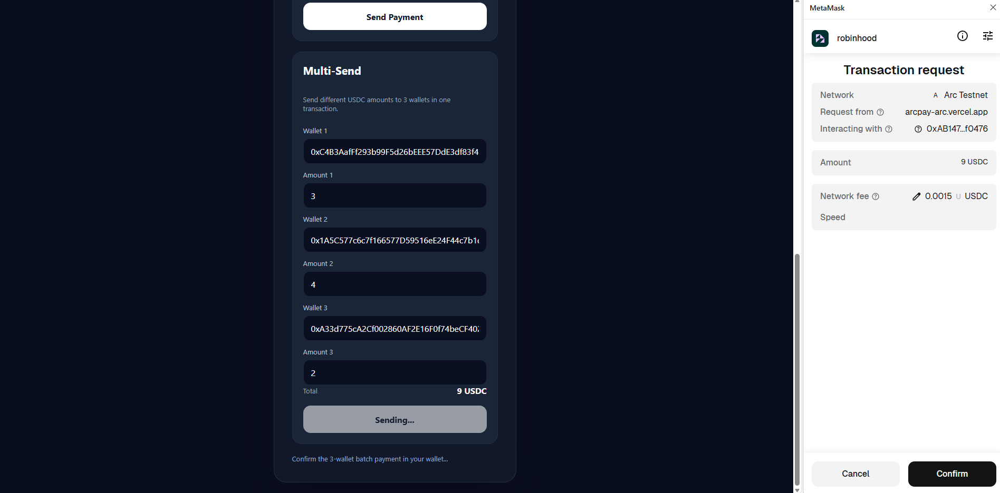
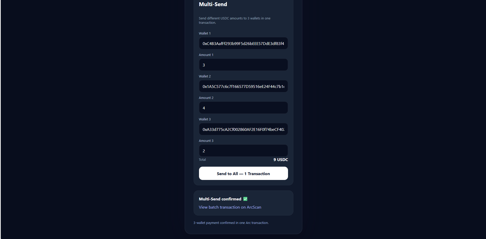
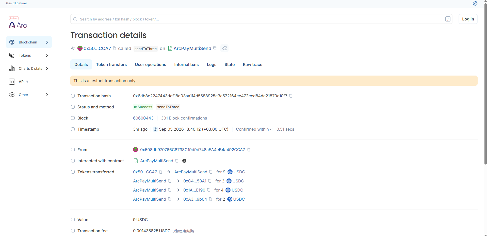

# ArcPay

A lightweight USDC payment dApp built on Arc Testnet.

[🚀 Live Demo](https://arcpay-arc.vercel.app/) • [🔎 Verified Testnet Transaction](https://testnet.arcscan.app/tx/0x1864f2e5c3f3e4423d83c9ca2e93e5fc461ef5dbbd107449f1b1b5f70a63037b)




ArcPay demonstrates how users can connect an EVM-compatible wallet, view their USDC balance, and send onchain payments through a simple web interface.


## Features


- Connect MetaMask wallet

- Automatic Arc Testnet network detection

- Live USDC balance

- Send USDC to any Arc Testnet address

- MetaMask transaction confirmation

- Onchain transaction tracking

- Direct ArcScan transaction link

- Responsive web interface
- Multi-Send: send different USDC amounts to 3 recipients in one transaction
- Smart-contract powered batch payments


## Built on Arc


ArcPay is built specifically to explore payments on Arc.


**Network:** Arc Testnet  

**Chain ID:** 5042002  

**Native Gas Token:** USDC


The application communicates directly with Arc Testnet through its RPC endpoint and uses `viem` for blockchain interactions.


## Tech Stack


- TypeScript

- Vite

- viem

- MetaMask

- Arc Testnet

- Node.js
- Solidity (ArcPayMultiSend)


## How It Works


1. User connects a MetaMask wallet.

2. ArcPay verifies that the wallet is connected to Arc Testnet.

3. The application reads the wallet's live USDC balance.

4. User enters a recipient address and payment amount.

5. MetaMask requests transaction approval.

6. The payment is submitted to Arc Testnet.

7. ArcPay waits for onchain confirmation.

8. The confirmed transaction can be viewed on ArcScan.


## Wallet Compatibility & Real-Device Testing

ArcPay is actively tested with real wallets on Arc Testnet.

### Browser Wallet

The injected Browser Wallet flow is currently the recommended and stable connection method.

Tested functionality includes:

- Wallet connection on Arc Testnet
- Native USDC balance display
- Native USDC payments
- Payment Links
- QR-based payment requests
- Wallet disconnect and permission handling

ArcPay has also been successfully tested inside the MetaMask Mobile in-app browser on Android, including a real Arc Testnet payment.

### Mobile Wallet Testing

During Android testing, wallet-side compatibility issues were identified in external mobile connection flows.

**MetaMask Mobile**

External WalletConnect/mobile connection attempts could freeze or fail to surface the expected transaction request, while the same ArcPay transaction flow worked through MetaMask Mobile's injected in-app browser provider.

ArcPay test results were contributed to the related open MetaMask Mobile issue:

- [MetaMask Mobile #34615 — WalletConnect does not work on mobile](https://github.com/MetaMask/metamask-mobile/issues/34615)

**Trust Wallet**

ArcPay loaded inside the Trust Wallet Android dApp browser, but the wallet connection did not complete correctly during testing.

The Arc Testnet test case was contributed to the related open Trust Wallet provider issue:

- [Trust Wallet Web3 Provider #763 — Android provider injection issue](https://github.com/TrustWallet/trust-web3-provider/issues/763)

### Current Approach

Until these mobile wallet compatibility issues are resolved, ArcPay keeps the production interface focused on the stable **Browser Wallet** flow.

Payment Link and QR infrastructure remain in place so broader mobile wallet support can be enabled again as compatibility improves.

These tests are part of ArcPay's ongoing development and interoperability work across the Arc ecosystem.


## Multi-Send — Verified on Arc Testnet

ArcPay includes a smart-contract powered **Multi-Send** flow for distributing different native USDC amounts to three recipients with **one wallet confirmation and one onchain transaction**.

**ArcPayMultiSend contract:**  
`0xAB147D7269dAe842D01A0985Ae62208A1A4f0476`

### One Transaction, Three Recipients

The verified test below sent a total of **9 USDC**:

- Wallet 1 — **3 USDC**
- Wallet 2 — **4 USDC**
- Wallet 3 — **2 USDC**
- Total — **9 USDC**
- Contract method — `sendToThree`

### Wallet Confirmation



The wallet receives a single **9 USDC** transaction request interacting with the `ArcPayMultiSend` contract on Arc Testnet.

### ArcPay Confirmation



ArcPay waits for the transaction receipt and exposes the confirmed transaction directly on ArcScan.

### Onchain Proof



**Verified Multi-Send Transaction:**  
`0x6db8e2247443def18d03aa1f4d5588925e3a572164cc472ccd84de21870c10f7`

[View verified Multi-Send transaction on ArcScan](https://testnet.arcscan.app/tx/0x6db8e2247443def18d03aa1f4d5588925e3a572164cc472ccd84de21870c10f7)

The ArcScan trace shows one successful `sendToThree` contract call distributing **3 USDC + 4 USDC + 2 USDC** to the three recipients.

**Flow:**  
Wallet → ArcPay → one wallet approval → ArcPayMultiSend → 3 recipients → Arc Testnet confirmation


## Run Locally


Clone the repository:


```bash

git clone https://github.com/Shirohige24/arcpay.git

## Live Testnet Transaction

ArcPay has been tested with a real onchain payment on Arc Testnet.

**Test Payment:** 0.01 USDC

**Transaction Hash:**
`0x1864f2e5c3f3e4423d83c9ca2e93e5fc461ef5dbbd107449f1b1b5f70a63037b`

[View transaction on ArcScan](https://testnet.arcscan.app/tx/0x1864f2e5c3f3e4423d83c9ca2e93e5fc461ef5dbbd107449f1b1b5f70a63037b)

This transaction demonstrates the complete ArcPay payment flow:

Wallet → ArcPay → MetaMask approval → Arc Testnet → Onchain confirmation
